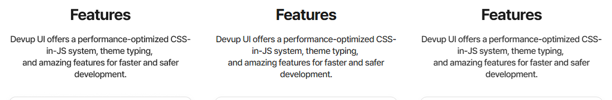

# Landing mobile: LCD glyph edges account for 1.87103 percentage points

Investigated from unmodified `4a0e434b4448f4c6c28105e609c34cd3fb06e258`
in W25-B-landing. This is a **quantified negative**, not a generator fix.
The standard mobile capture remains 4.7829479225%; the requested production
improvement is not claimed. No Rust, plugin golden, threshold, or harness
script changed. No shared codegen file needs merging.

## Fresh baseline and localisation

The own-target baseline executable was preserved before test builds, SHA-256
`12789c3b262d7034c5d730699be066cf70db3846beefc5e84cd423b949236ce2`.
Fresh acquisition used that executable, copied call-bank/exported-asset caches,
and unchanged scripts in an isolated local harness. Two standard render runs
reproduced each exact result below. The comparator is the unchanged executable
copied from main; all generator builds and gates use this worktree's target.
No acquisition identity check was bypassed. An initial acquisition with an
unindexed asset cache was stopped, its processes terminated, and acquisition
restarted with the cache indexed; only the completed acquisition is measured.

| Width | Both standard baseline runs: changed pixels | Percent | Rendered dimensions |
| ---: | ---: | ---: | --- |
| 360 | 50,881 | 4.7829479225 | 360x2955 |
| 992 | 72,515 | 2.4662550063 | 992x2964 |
| 1920 | 89,041 | 1.5037458117 | 1920x3084 |

These are own measurements, not threshold values. The one-pixel differences
from some earlier reports are retained, not rounded away.

All seven preceding reports were read. `bands.mjs` finds mobile's worst bands
at y=1500–1600 (13.70%), 300–400 (12.62%), and 900–1000 (11.78%).
`drift.mjs` prefers zero vertical offset throughout the populated main content;
the footer prefers -1px. The empty y=2700 band has tied zero-error offsets,
so its first returned offset is not displacement evidence.
`boxes.mjs`, `elements.mjs`, and `crop.mjs` were run before any proposed fix.
The full-height capture remains the height authority, not the diagnostic
boxes script's capped viewport.

The named element is **Features paragraph `833:3725`**, with source and browser
box **(16,1520), 328x84**. Its line composition agrees. The difference is inside
the glyphs, particularly **colored horizontal edge coverage**, not movement of
the paragraph. Its resolved 16px medium Pretendard, -0.48px spacing and 21px
line advance agree with the collected fields. The hero heading `833:3646`,
hero subtitle `833:3647`, benchmark caption `833:3665`, and Features paragraph
all have exact source/browser x, y, width and height. No missing letter-spacing
override was found in these visible regions.

Landing's two IMAGE-fill nodes have no live children, excluding the documented
about hero's duplicated child-composition mechanism. `elements.mjs` measures
the hero export at its intrinsic 360x363 and the footer image at 143x30. The
collected 511x511 hero layer and clipped export are different bounds; that
alone is not evidence to rescale the export.

## Controlled rasterization probe

An isolated Playwright script launches Chromium with exactly one changed
startup argument, `--disable-lcd-text`. It uses the same generated module,
screen-specific compiled theme, viewport, locale, loaded fonts, decoded images,
animation-disabled page, transparent screenshot and 24-channel tolerance.
It does not rewrite TSX, CSS, source node data or the reference.

The probe's default-argument PNG is **byte-identical to the standard harness
capture at every width**. All four variants have identical hashes of every
DOM element's x/y/width/height, font, letter spacing, whitespace and word-break
properties. Thus the intervention changes rasterization without a layout
change. It is not a replacement measurement configuration or a shipped fix.

| Width | Standard baseline | LCD-disabled probe | Pixels removed | Reduction, pp |
| ---: | ---: | ---: | ---: | ---: |
| 360 | 4.7829479225% | 2.9119195337% | 19,904 | 1.8710283888 |
| 992 | 2.4662550063% | 1.6098082909% | 25,182 | 0.8564467154 |
| 1920 | 1.5037458117% | 1.0341513997% | 27,806 | 0.4695944120 |

The probe was repeated at every width and reproduced the exact counts.
`--font-render-hinting=none` alone changes zero pixels; combining it with
`--disable-lcd-text` reproduces the LCD-disabled result exactly. Font hinting
is therefore ruled out as the explanation for this measured improvement.

The neutral Features paragraph has **zero** pixels whose RGB channel spread
exceeds 24 in the reference, **4,651** in the default capture, and **zero** in
the LCD-disabled capture. The same region has 4,939 mismatching pixels by
default and 2,452 with LCD disabled. This distinguishes a demonstrated
chromatic rasterization contribution from a generic assertion that fonts differ.

## What remains and why no Rust correction is shipped

LCD rasterization accounts for a measured net 39.12% of mobile's changed pixels,
but does not explain all remaining pixels. A search of integer offsets
dx=-3..3 and dy=-2..2 within named text boxes still prefers (0,0) for the
hero heading, hero subtitle, Features paragraph, benchmark caption, and all
four feature descriptions after LCD is disabled. A global text shift would
therefore move these correctly placed regions away from their best alignment.

Residual exceptions are retained as leads rather than generalized: footer
address `833:3817` prefers dy=-1; copyright `833:3818` prefers dx=3,dy=-1;
right-aligned benchmark values have roughly 1–2px horizontal preferences and
slightly different HUG widths. Those preferences are not uniform across text
of the same screen and are not proof of a safe generator rule. They require
separate glyph-advance, font-file, and baseline evidence. Figma's exact font
binary is not established by a matching family name.

The harness already requests `-webkit-font-smoothing: antialiased`, but that
declaration did not prevent the observed LCD edges in this Windows capture.
There is no collected node field here that justifies a Rust glyph-position
correction or a synthetic compositing workaround. The causal intervention is
a browser startup configuration, and the rendering harness is explicitly
off-limits. No permission request or edit is needed to deliver this negative.
The next cycle can separate the demonstrated rasterization contribution from
layout defects before investigating the remaining per-run advances; changing
the official capture contract would be a distinct owner decision with corpus
remeasurement, not this task's generator improvement.

Korean `keep-all` is unchanged. The owner's approximately 0.21pp allowance is
specific to about mobile and is excluded from defect accounting; it is not
transferred numerically to this predominantly English landing screen. No
Korean-breaking experiment was run.

No production candidate exists, so the normal-render before/after delta is
**zero**, and no all-screen no-regression measurement is claimed. Production
source, all 268 plugin goldens, the corpus consistency test, provenance and
source maps are unchanged. No new failing regression test is presented because
no implementation was attempted; the paired browser probes are the experiment.

## Evidence and verification

[landing-rasterization-evidence.json](landing-rasterization-evidence.json)
retains both full baseline reports, binary/reference/actual hashes, controlled
probe results, geometry hashes, source/browser text boxes, line ranges and
local offset scores. Raw logs and diagnostic scripts are under this worktree's
ignored `harness/render/out/w25-*`; the durable JSON and crop preserve the
finding independently of those scratch files.

All Cargo commands use `CARGO_PROFILE_DEV_DEBUG=0`,
`CARGO_PROFILE_TEST_DEBUG=0`, `CARGO_INCREMENTAL=0`, and two jobs, including
`CARGO_BUILD_JOBS=2`. `CARGO_TARGET_DIR` is never set.

| Required gate | Result |
| --- | --- |
| `cargo fmt --all -- --check` | Pass |
| `cargo clippy --locked --workspace --all-targets --all-features -j 2 -- -D warnings` | Pass, zero warnings |
| `cargo test --workspace -j 2 --no-fail-fast` | 1,118 passed / 0 failed / 2 ignored |
| `cargo insta test --workspace --all-features --check` | 1,118 passed / 0 failed / 2 ignored; no snapshots to review |
| `cargo test --locked -p devup-mcp --test stdio_smoke -j 2` | 2 passed / 0 failed |

Ordinary MSVC test links emit the pre-existing localized library-creation
message; Clippy's warnings-as-errors gate is clean. The documentation is
committed locally without pushing, followed by own-target `cargo clean` and
cleanup of task-started acquisition and preview processes.
